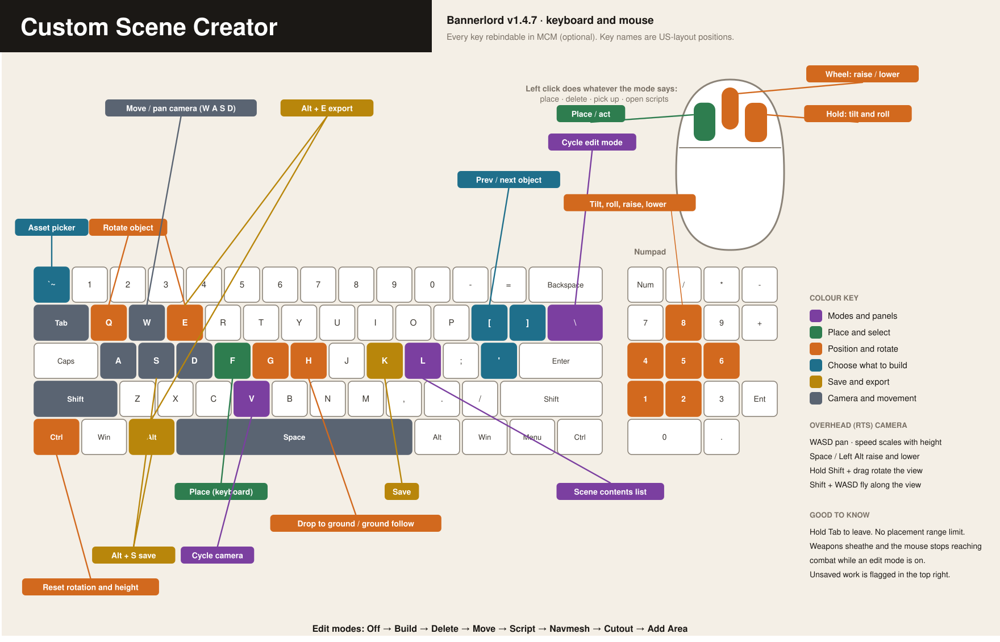

# Custom Bannerlord Scene Creator

A standalone in-game scene editor for **Mount & Blade II: Bannerlord v1.4.7**.

Open any shipped scene, place any shipped prefab or logical marker, and export the result — without
the Modding Kit.

> **Status: early development, but usable.** Entered from inside a campaign (settlement menu or
> `csc.open`). Scene browser, asset catalog, RTS/third/first-person cameras, and build/delete/move
> with JSON project save-load are all in, plus a searchable asset picker, editor-authored marker
> packs, reusable prefab and complete-scene export, navmesh inspection and file-side baking (cutouts,
> missing ground, stairs, ramps, bridges, and raised walks), and script attachment. Still to come:
> entity-reference variables and derivation filters.
> New here? Start with the [user manual](USER_MANUAL.htm).
> See [CUSTOM_SCENE_CREATOR_PLAN.md](CUSTOM_SCENE_CREATOR_PLAN.md) for the full design and
> milestone list.

---

## Why

Building a scene for Bannerlord normally means the Modding Kit: a separate multi-gigabyte download,
a long load, and an editor that runs outside the game you are building for. For laying out objects —
a graveyard, a race track, a fortified camp — that is a lot of machinery to stand up before you can
place a single crate.

This puts the layout half in the game itself. You open the scene you want, walk or fly around it, and
place things where they look right, with the real lighting and the real terrain. What comes out is
plain XML the Modding Kit (or anything else) can pick up.

It is also built as a library rather than an application: the editor talks to an `ISceneEditTarget`
interface and never learns what it is editing, so another mod can host the same editor over its own
storage.

## What it does

- **All 611 shipped scenes** — battle terrain, multiplayer maps, towns, castles, villages, hideouts,
  arenas, interiors, naval. Categorized and searchable, with correct upgrade-level handling.
- **Derived scenes** — copy a shipped scene's terrain, navmesh, flora and atmosphere, but strip its
  mission scripts, so you get a hideout's landscape without the hideout's logic.
- **Logical placeables** — spawn points, navigation nodes, race gates and patrol points as
  first-class objects with proxy meshes. Declared in `ModuleData/packs/*.xml`, so a mod or a user can
  add their own markers without a rebuild. They export under their declared name and tag, so
  `FindEntitiesWithTag("sp_enemy")` finds them.
- **Script attachment** — in **Script** mode, click a placed object to see what scripts are on it,
  add more from a searchable list of the 130 the game ships, and edit their variables. Bools are
  buttons, and string variables offer the values shipped scenes actually use — you cannot type an
  FMOD event path like `event:/mission/ambient/detail/river_01` from memory, and the real list lives
  in sound banks the game never exposes. Attached scripts preview live where they can, and are
  written out on export either way.
- **Templates** — export a layout to `exports/templates/` and it appears in the picker under **My
  Templates**, placing as loose, individually editable pieces rather than as one sealed object. No
  restart: this mod reads the file itself rather than registering it with the engine. This is how you
  reuse a layout across several maps and still adapt it to each one. Templates contain visible
  entities only; redraw navmesh authoring in each destination project.
- **Modding Kit handoff** — clone the selected base scene into a unique `csc_*` scene owned by this
  module, rename it internally, insert the placed entities, and carry across its terrain, flora,
  atmosphere, navmesh, and any other published support files. CSC applies every authored cutout,
  ground addition, and elevated route to the copy. The Modding Kit is an optional fallback for work
  CSC cannot express; no manual XML pasting is required.

## Building

Requires the .NET SDK. Reference assemblies come from NuGet (`Bannerlord.ReferenceAssemblies
1.4.7.117484`); no local game install is needed to compile.

```bash
build.bat
```

This builds to `Dist/CustomSceneCreator/` and offers to deploy into your game's `Modules` folder.

To compile without deploying:

```bash
dotnet build CustomSceneCreator/CustomSceneCreator.csproj -c Release -p:Platform=x64
```

## Tools

Generators that read your local game install. Regenerate these after a game update.

| Script | Produces |
|---|---|
| `tools/build_scene_catalog.ps1` | `ModuleData/scene_catalog.xml` — every scene, its module, category, upgrade levels, and missing-support-file flags |
| `tools/build_asset_dump.ps1` | `ModuleData/bannerlord_assets_v<version>.txt` — every placeable prefab. Column layout matches the legacy dump so existing bake scripts keep working. |
| `tools/build_script_catalog.ps1` | `ModuleData/script_catalog.xml` — every scene script, its variables, inferred types, how often shipped scenes use it, and the values each string variable is set to (values seen in at least two scenes, so scene-local names are left out) |

Pass `-GameDir` if your install is not at the default path, and `-IncludeAllModules` to
`build_asset_dump.ps1` to pull your own mod's prefabs into the editor's picker — see
[README_REGENERATE.md](tools/README_REGENERATE.md). Keep such a dump local: it describes your
installation, so entries would fail to instantiate for anyone else.

`tools/bake_scene.py` post-processes an export: expanding markers into working entities, attaching
scripts in bulk, renaming tags, assigning GUIDs, and deploying the result. Driven by
`bake_config.json` and meant to be edited — see [README_BAKE.md](tools/README_BAKE.md).

`tools/check_scene_folders.py` audits a Modules folder for the three faults that make a scene load
but not work — a name mismatch, a folder shadowing a stock scene, or a missing navmesh. The editor
runs the same checks at startup; this is for auditing a module before you ship it. See
[Pasting a fragment into a real scene](#pasting-a-fragment-into-a-real-scene).

## Editor controls

Rebindable in MCM's options screen if you have it installed (**Mod Options → Custom Scene Creator**).
MCM is optional — without it the editor runs on the defaults below.

Bindings are typed as `InputKey` names, which are physical **US-layout key positions**, not the letter
printed on the cap. Turn on **Key Detection Mode** in the settings and press a key to be told its
name — the only practical way to rebind on AZERTY or QWERTZ.

A scene opens in **third person, walking around**, like any other mission. Turning edit mode on with
`\` switches to the **RTS camera** - look down at the site, pan around it, and place where the
**cursor** is - and turning editing off returns you to walking.

`V` overrides that at any time, and once you have chosen a camera yourself the editor stops changing
it for you.



| Key | Action |
|---|---|
| `\` | Cycle edit mode: Off - Build - Delete - Move - Script - Navmesh - Navmesh Cutout - Add Navmesh Area - Elevated Navmesh |
| **LMB** | Place / delete / pick up / open scripts / set navmesh points / toggle a cutout or navmesh-needed area — works in every camera mode |
| `F` | Same, from the keyboard |
| **Hold RMB** + move mouse | Rotate the held object |
| `Q` `E` | Rotate left / right |
| **Left Ctrl** | Reset rotation and height offset |
| `G` | Drop to ground, and re-enable ground follow |
| `H` | Toggle ground follow (pin the height instead) |
| Mouse wheel | Raise / lower the held object |
| **`** | Open the asset picker: choose a category, search within it, inspect, build |
| `L` | Open the scene contents list: everything placed, with editable position and rotation, plus Go To / Scripts / Pick Up / Delete |
| `[` `]` | Previous / next placeable (quick cycle without the picker) |
| `'` | Next category |
| `V` | Cycle camera: RTS - third person - first person |
| **Alt+S** or `K` | Save the project (confirmation shown) |
| **Alt+E** | Export: prefab, or whole scene |
| Numpad `8` `2` | Tilt up / down |
| Numpad `4` `6` | Roll left / right |
| Numpad `5` `1` | Raise / lower |

RTS camera: `WASD` pans, `Space` / `Left Alt` change height, hold `Shift` and drag to rotate the
view, `Shift`+`WASD` flies along the view direction. Pan speed scales with height.

There is no maximum placement range - if you can see it, you can build on it.

Avoid rebinding onto `P` (the game's pick-up-item bind).

While an edit mode is active in the third- or first-person cameras, the mouse is held off the combat
controls — no swinging, no blocking, no weapon-swapping on the wheel (the wheel raises and lowers the
held object instead). Walking and looking are untouched. Use `F` to place if the click does not
register. Everything returns to normal when editing is off.

A reminder appears in the top right whenever there is unsaved work, naming the save keys.

Leaving with unsaved changes offers to save first.

### Navmesh diagnostics

Cycle to **NAVMESH - READ ONLY**. The top-left panel continuously reports the baked navigation face,
face group, and island under the cursor, plus the vertical difference between the visible surface and
the navmesh. A large positive delta usually means the navmesh continues underneath a roof or newly
placed building.

The selected face is also drawn as a wireframe. Bannerlord does not expose its vertex array to
managed mods, so the editor reconstructs the perimeter by sweeping the public face-boundary query
outward from the face center. In Cutout mode, the sampled faces beneath every marked building are
drawn in orange, making the real irregular mesh visible against the proposed building footprint.

Click once to set route point A and again to set B. The panel reports whether a 0.4 m-radius infantry
agent can reach B, straight-line and path distances, detour ratio, and whether the direct line is
clear. A third click starts a new A/B pair. These probes are temporary, read-only, and are never saved
or exported with the scene.

Cycle once more to **NAVMESH CUTOUT PLAN** and click a solid object placed by this editor. The
editor measures its physics footprint, adds 0.75 m agent clearance, draws the proposed perimeter,
and samples the baked face IDs beneath it. Click it again to remove the cutout. Cutouts survive save,
follow a moved object, and disappear with a deleted object.

Cycle once more to **ADD NAVMESH AREA** to mark the opposite problem: terrain where agents need to
walk but no baked navmesh exists. Click unmeshed ground to mark a 4 m area; aim near its center and
click again to remove it. Marking samples the terrain height around the rim, so the ground built
there follows slopes and steps rather than lying flat across them. Overlapping marks are filled as
one continuous surface. Clicking already meshed ground is rejected, so these marks cannot be confused
with building cutouts.

Cycle once more to **ELEVATED NAVMESH** for stairs, ramps, bridges, tunnels, platforms, and wall
walks. Click at least four points around the edge of the physical walking surface, in clockwise or
counter-clockwise order, then press `F` to close the area. A cyan placement ghost shows the exact
surface and height the next point will use. A closed outline may have more than four points. Click a
saved point to select it (blue), click again to move it, or press `Delete` to remove it. While an
outline is open, only points in that outline can be selected, so two areas may share a corner.

### Baking

Baking happens with your save. **Rebake Navmesh** in Saved Projects forces a fresh bake and shows
progress even when the authoring data has not changed.

- **Saving a project** writes the layout, the readable `.navcut.json` handoff, and a baked navmesh at
  `exports/navmesh/<project>.navmesh.bin`. The save message reports how many footprints were cut out,
  how many ground areas and elevated routes were built, and what was skipped and why.
- **Exporting a Modding Kit scene** bakes the navmesh inside the exported SceneObj folder, so the
  folder is complete rather than carrying the source scene's mesh.

The game's own scene files are never written to, and a bake keeps the original as `.prebake` wherever
it replaces something. Each footprint is applied independently: one that cannot be done cleanly is
skipped and named, and everything else still bakes.

The mission you are standing in keeps the navmesh it loaded with, so a bake is visible when you load
the exported scene, not immediately.

### Checking the whole map

```
csc.navmesh_audit <project name>
```

This walks the entire baked navmesh, rather than the corner of it a test battle happens in, and
reports each finding with coordinates: ground cut off from the rest of the map, footprints that are
still walkable, marked areas that are still unwalkable, and broken topology.

Findings are also marked in the scene — a ring with a tall mast, red where movement will break and
amber for anything else — visible in every edit mode, and hidden again with `csc.navmesh_audit_clear`.
Run the audit before shipping a scene; use `csc.navtest` afterwards to watch agents actually move.

The Python tools in [`tools/README_NAVMESH.md`](tools/README_NAVMESH.md) are advanced inspection and
regression tools. Normal authoring and baking happens inside CSC; the C# baker is authoritative,
especially for elevated routes.

## Where things are written

`Documents\Mount and Blade II Bannerlord\CustomSceneCreator\`

| Folder | Contents |
|---|---|
| `projects/` | Working files (`.json`), one per scene by default. This is what you reopen to keep building. |
| `exports/prefabs/` | Prefab XML — one reusable object, positioned relative to its own base |
| `exports/scenes/` | Scene fragments — everything at its real position, for pasting into a `scene.xscene` |
| `exports/templates/` | Templates — a layout to place into other scenes as loose, still-editable pieces |
| `exports/navmesh-cutouts/` | Portable cutout footprints, sampled face IDs, and navmesh-required area notes (`.navcut.json`) |
| `exports/navmesh/` | Durable baked navmesh for each project (`<project>.navmesh.bin`) |
| `Modules/CustomSceneCreator/SceneObj/csc_*/` | Complete derived scenes created for the Modding Kit |

**A project is what you reopen; an export is a produced artifact.** The settlement menu opens the
saved-project list, with "New - Pick a Scene" one button away. `csc.projects` lists them in the
console and `csc.project <name>` opens one directly. A project remembers its scene and levels, so
reopening restores the whole session rather than dropping objects into whatever scene was last used.

To keep working on something you exported as a prefab, reopen the **project** it came from — the
prefab is the finished artifact, not the source.

## Testing a saved project

Select a project in **Saved Projects**, then choose **Walk Around** or **Raid-Scale Battle**. Both
tests restore that project's objects and matching baked navmesh through a disposable test slot; they
do not alter the project or campaign roster.

**Walk Around** spawns every healthy companion hero in the main party plus five additional Empire
peasants, all on foot and following the player. Lead the entire group through tunnels and doorways
and over every stair, ramp, bridge, platform, wall walk, and ground/elevated transition. This is the
best test for the exact place where a route becomes disconnected or too narrow.

**Raid-Scale Battle** copies the healthy player party into a combat mission and creates a matching
raid-style bandit/looter force, capped at 100 agents per side and with no horses. Projects with
cutouts place the forces on opposite sides of the obstacle cluster at least 200 metres apart; without
cutouts, the mode uses a shorter fallback placement. Use this after Walk Around to expose crowding,
formation, and combat-routing failures. Test casualties never return to the campaign.

The `csc_navmesh_test_slot_*` folders are test caches only. Do not move them into another module or
ship them as finished scenes. See `MOD_INTEGRATION.md` for the complete release workflow.

The picker lists whatever is in `exports/prefabs`, and exports are **also** copied into
`Modules/CustomSceneCreator/Prefabs/`. Anything you drop into `exports/prefabs` is mirrored there
when the editor next opens, so a prefab from someone else is loadable however the game resolves it —
restart once and it places under **My Prefabs**.

**Export Whole Scene** remains the absolute-coordinate fragment workflow used by layouts such as
horse racetracks. It writes `exports/scenes/<name>.scene_fragment.xml`; it does not clone the base
scene or replace the editable project. **Create Modding Kit Scene** is an additional complete-scene
handoff, not a replacement for this fragment export.

## Creating a Modding Kit scene

Press `Alt+E`, give the export a name, and choose **Create Modding Kit Scene**. The editor creates:

```text
Modules/CustomSceneCreator/SceneObj/csc_<name>/
```

It locates the project's source scene, copies every published support file except the generated
`ShaderCache`, changes the internal `<scene name="...">` to match the new folder, and inserts all
placed entities. If the source module provides matching `SceneEditData`, that is copied as well. The
new scene is registered under **My Derived Scenes** in our browser.

Existing derived folders are never overwritten. This protects navmesh or terrain work performed in
the Modding Kit; choose a new export name when you want another revision.

The output contains `CSC_MODDING_KIT_HANDOFF.txt`, which names the source and records what CSC baked.
If the export message reports all requested operations applied, the `navmesh.bin` already matches the
placed objects. Open the scene in the Kit only if you need terrain editing or manual navmesh work CSC
cannot express. Repeat the in-game A/B diagnostic, Walk Around test, and—when intended for combat—
Raid-Scale Battle before shipping.

When only navigation changed, use the Kit's explicit **File → Save Navigation Mesh** command. Our
current Kit build has repeatedly crashed during the broader **Save Scene** terrain-staging step even
though saving `navmesh.bin` separately succeeds.

Before release, move the completed `SceneObj/csc_*` folder into the module that will own the finished
scene. Move the matching `SceneEditData/csc_*` folder too only if you want that scene to remain
editable in the Modding Kit; Bannerlord does not need SceneEditData at runtime.

The exporter prevents the most common handoff errors, but these remain useful context:

All three faults below look identical in game: the scene loads, the terrain draws, agents spawn and
draw their weapons, and then **melee never engages while archers carry on shooting**. It reads as an
AI bug. It is not one — nothing can path.

**1. Folder and internal scene names must match.**

Copying a stock scene folder and renaming the directory leaves the old name inside:

```xml
<scene name="battle_terrain_006" version="2">   <!-- but the folder is now ghoul_caravan -->
```

Every stock scene has these matching. Edit the `name` attribute to match your folder.

**2. Never leave a folder named after a stock scene.**

Bannerlord resolves a scene by name across *every* loaded module. A folder in your mod called
`battle_terrain_006` will shadow the real one — and if it holds only a `ShaderCache` directory, the
game gets a scene with no navmesh. These appear on their own: the engine writes shader cache next to
whichever scene folder it resolved. Delete any `SceneObj/<stock scene name>/` folder that has no
`scene.xscene` of its own.

**3. Bake the navmesh after adding props.**

Mark solid footprints, missing ground, and elevated walking surfaces in CSC, then save or use
**Rebake Navmesh**. **Create Modding Kit Scene** applies that authoring to the cloned scene. The Kit is
only the fallback when CSC reports a skipped operation or you need a kind of manual edit it does not
support.

**Check all three at once.** The editor audits every installed module's scene folders at startup and
writes any problems to the trace log. To check a module you are about to ship, without launching the
game:

```bash
python tools/check_scene_folders.py "…\Mount & Blade II Bannerlord\Modules"
```

```
AgainstAllEvil/SceneObj/ghoul_caravan
  ! scene.xscene declares name="battle_terrain_006" but the folder is "ghoul_caravan".
```

**Or skip scene folders entirely.** Export a **prefab** instead of a fragment and have your mod
instantiate it at an anchor on a stock battle map. This avoids scene-folder naming and missing-file
faults. Prefab XML carries CSC's cutout and elevated-route markers in local coordinates, but Bannerlord
does not apply those markers by itself: the consuming mod must run a compatible file-side baker before
the scene is loaded, as Homesteads Reloaded does. See [MOD_INTEGRATION.md](MOD_INTEGRATION.md) for the
complete artifact-by-artifact shipping checklist.

## Logging

Writes to `%ProgramData%\Mount and Blade II Bannerlord\logs\CustomSceneCreator.trace.log`.

The scene folder audit runs once at startup and logs a `PROBLEM …` line per fault, naming the module
and folder. If a scene of yours loads but nothing will fight in it, read this log first.

## Releasing

```bash
powershell -ExecutionPolicy Bypass -File tools/package_release.ps1
```

Builds, then writes a single `CustomSceneCreator-v<version>.zip` containing the module folder, the
user manual and the bake tools — the whole thing someone needs, in one file. Pass `-SkipBuild` to
package what is already in `Dist`.

## License

[MIT](LICENSE) — use it, fork it, ship things built with it.

The generated catalogs under `ModuleData` are indexes of TaleWorlds' own game data and are not
covered; regenerate them from your own installation with the scripts in `tools/`. Scenes you build
reference game assets by name rather than containing them, so an export is a layout, not a copy of
anyone's art.
